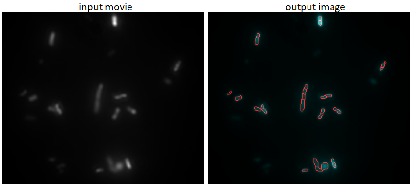
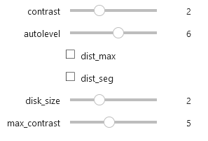
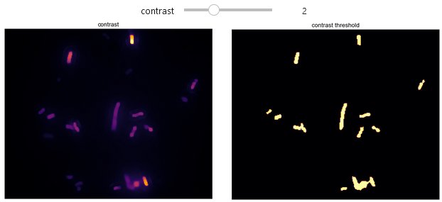
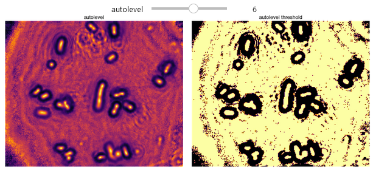
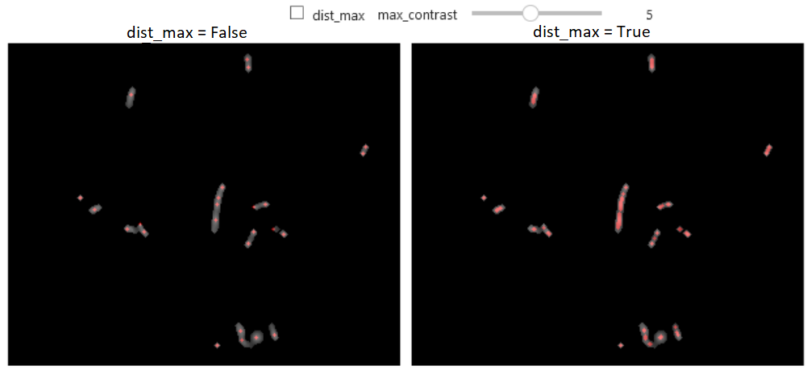
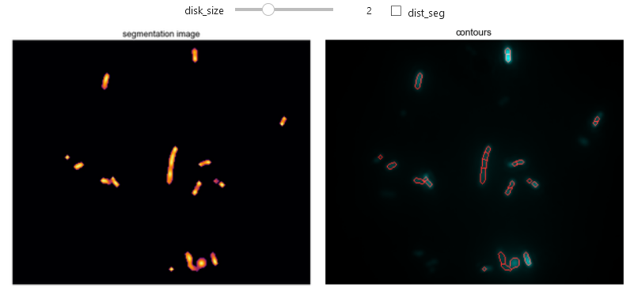

# Introduction

This code's input is a TIF movie of fluorescence objects. 
This code's expected output is an image with an area of interest for each object in the movie.

Example: 


Open this in a new tab: [](https://mybinder.org/v2/gh/Alienor134/image_segmentation/main?urlpath=lab)  
 The code will load while you read this page.
# Flexibility

The jupyter notebook provided allows to upload your own video and test the segmentation. The interface is interactive and allows you to test the various parameters to obtain the best segmentation.  
Once you have found the optimal parameters for your segmentation you can collect the *segment_image* function and inculde it in your image analysis process.

Interactive parameters: 



To have a detailed explanation of the code, TODO(link to SI of the paper).

You can also do intuitive trials. Here is how each parameter affects the intermediary steps of the code which are displayed as images:   

Contrast mask:   

  

Autolevel mask:   

  

Maximum positions (center of the isolated objects):  

  

Segmentation mask and contours:  


  

The range of the parameters can be changed to better suit your needs !
Simply modify the number in parenthesis in the line: 

```
interact(segment_image, contrast = (1, 4), autolevel = (1, 10), dist_max = False, dist_seg = False, disk_size = (1, 4), max_contrast = (1,10), soft_hard = (0.1, 1.9))
```


# Use

To try the segmentation on your own data you have two choices depending on your data policy. 
- [simple/open data] You can try the online version (you will have to upload your data on the internet) by clicking here :  [](https://mybinder.org/v2/gh/Alienor134/image_segmentation/main?urlpath=lab)

- [requires install/private data] You can download the code and use it on your computer: 
in the command line cd to a directory where you want to save the code and write:
  ```
  git clone https://github.com/Alienor134/image_segmentation.git
  cd image_segmentation
  conda create --name segmentation --file requirements.txt
  conda activate segmentation
  jupyter lab
  ```

  TODO: docker with repo2docker


